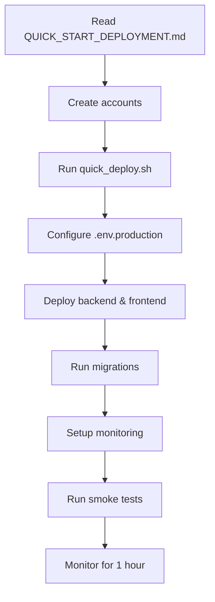
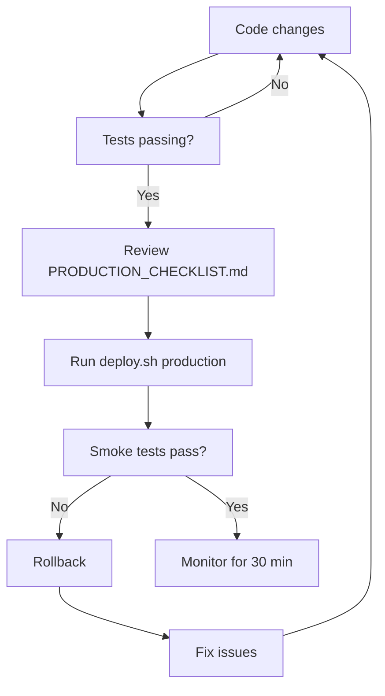
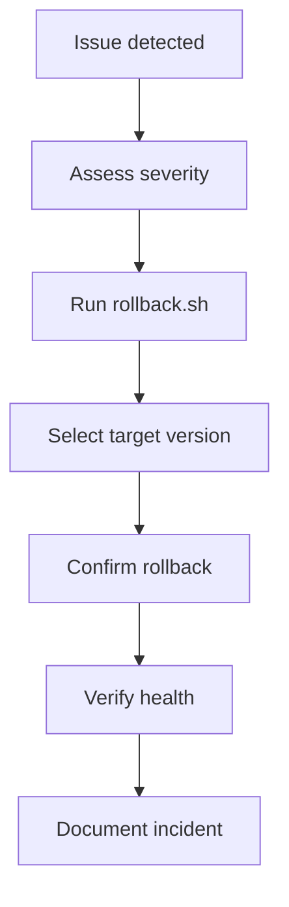

# Deployment Documentation Index

Complete guide to deploying the Quant Analytics Platform to production.

## 🚀 Getting Started

### New to Deployment?
Start here: **[QUICK_START_DEPLOYMENT.md](./QUICK_START_DEPLOYMENT.md)**
- 30-minute deployment guide
- Step-by-step instructions
- Common issues and solutions

### First-Time Deployment?
Use the interactive wizard:
```bash
./scripts/quick_deploy.sh
```

## 📚 Documentation

### Core Guides

#### [DEPLOYMENT_GUIDE.md](./DEPLOYMENT_GUIDE.md)
Complete deployment reference (350+ lines)
- Prerequisites and setup
- Hosting options comparison
- Step-by-step deployment
- Post-deployment verification
- Troubleshooting guide
- Best practices

**When to use:** Detailed reference, troubleshooting, understanding options

---

#### [PRODUCTION_CHECKLIST.md](./PRODUCTION_CHECKLIST.md)
Comprehensive checklists (300+ lines)
- Pre-deployment checklist (60+ items)
- Deployment execution steps
- Post-deployment verification
- Rollback procedures
- Weekly/monthly maintenance
- Emergency procedures

**When to use:** Before/during/after deployment, regular maintenance

---

#### [monitoring/README.md](./monitoring/README.md)
Monitoring setup guide (500+ lines)
- Sentry integration
- Prometheus configuration
- Grafana dashboards
- Alert setup
- Custom metrics
- Troubleshooting

**When to use:** Setting up monitoring, troubleshooting observability

---

#### [scripts/README.md](./scripts/README.md)
Automation scripts reference
- Script descriptions
- Usage examples
- Customization guide
- Troubleshooting

**When to use:** Understanding and customizing deployment scripts

---

## 🛠️ Configuration Files

### Environment Configuration

#### `.env.production`
Production environment variables
- Database credentials
- Redis configuration
- API keys
- Monitoring setup
- Security settings
- Performance tuning

**Action required:** Copy from `.env.example` and customize

---

### Docker Configuration

#### `docker-compose.production.yml`
Production Docker Compose setup
- PostgreSQL with TimescaleDB
- Redis with persistence
- Backend API with limits
- Celery workers
- Prometheus metrics
- Grafana dashboards
- Nginx reverse proxy

**Use for:** Self-hosted production deployment

---

### Production Requirements

#### `backend/requirements.production.txt`
Optimized production dependencies
- Core framework
- Performance optimizations
- Production monitoring
- No development dependencies

---

## 🤖 Automation Scripts

### Deployment Scripts

#### `scripts/quick_deploy.sh`
Interactive deployment wizard
```bash
./scripts/quick_deploy.sh
```
**Use for:** First-time deployment, guided setup

---

#### `scripts/deploy.sh`
Automated production deployment
```bash
./scripts/deploy.sh production
```
**Use for:** Regular deployments after initial setup

**Features:**
- Pre-flight checks
- Automated testing
- Database migrations
- Smoke tests
- Git tagging

---

#### `scripts/rollback.sh`
Emergency rollback procedure
```bash
./scripts/rollback.sh production
```
**Use for:** Deployment failures, critical bugs

**Features:**
- Interactive tag selection
- Automatic backups
- Database rollback option
- Verification tests

---

### Monitoring Scripts

#### `scripts/setup_monitoring.sh`
Monitoring stack initialization
```bash
./scripts/setup_monitoring.sh
```
**Use for:** Initial monitoring setup, troubleshooting

---

### Testing Scripts

#### `scripts/smoke_test.py`
Production health verification
```bash
python scripts/smoke_test.py --url https://api.yourdomain.com
```
**Use for:** Post-deployment verification, health checks

**Tests:**
- API availability
- Database connectivity
- Cache connectivity
- Security headers
- Response times
- SSL certificates

---

## 🔄 CI/CD Workflows

### `.github/workflows/test.yml`
Continuous integration testing
- Runs on every PR
- Backend + frontend tests
- Security scanning
- Docker build verification

---

### `.github/workflows/deploy-production.yml`
Production deployment pipeline
- Runs on push to main
- Automated deployment
- Database migrations
- Smoke tests
- Slack notifications
- Auto-rollback on failure

---

### `.github/workflows/database-migration.yml`
Manual migration control
- Manual workflow dispatch
- Environment selection
- Migration preview
- Rollback support

---

## 📊 Monitoring Configuration

### Prometheus

#### `monitoring/prometheus/prometheus.yml`
Metrics collection configuration
- Scrape targets
- Collection intervals
- Alert manager setup

---

#### `monitoring/prometheus/alerts.yml`
Alert rules (25+ rules)
- API health alerts
- Database alerts
- System alerts
- Celery alerts

---

### Grafana

#### `monitoring/grafana/dashboards/`
Pre-configured dashboards
- Application overview
- Database performance
- System resources

---

## 🌐 Infrastructure

### Nginx

#### `infrastructure/nginx/nginx.conf`
Production reverse proxy
- SSL/TLS configuration
- Rate limiting
- Security headers
- Gzip compression
- Caching rules

---

## 📖 Quick Reference

### Common Tasks

| Task | Command | Documentation |
|------|---------|---------------|
| First deployment | `./scripts/quick_deploy.sh` | [QUICK_START_DEPLOYMENT.md](./QUICK_START_DEPLOYMENT.md) |
| Regular deployment | `./scripts/deploy.sh production` | [scripts/README.md](./scripts/README.md) |
| Rollback | `./scripts/rollback.sh production` | [DEPLOYMENT_GUIDE.md](./DEPLOYMENT_GUIDE.md#rollback-procedures) |
| Health check | `python scripts/smoke_test.py --url URL` | [scripts/README.md](./scripts/README.md#smoke_testpy) |
| Setup monitoring | `./scripts/setup_monitoring.sh` | [monitoring/README.md](./monitoring/README.md) |
| Run migrations | `alembic upgrade head` | [DEPLOYMENT_GUIDE.md](./DEPLOYMENT_GUIDE.md#database-migration) |
| View logs | `railway logs` | [DEPLOYMENT_GUIDE.md](./DEPLOYMENT_GUIDE.md#troubleshooting) |

---

### Configuration Files

| File | Purpose | Action Required |
|------|---------|-----------------|
| `.env.production` | Production environment variables | ✅ Must configure |
| `docker-compose.production.yml` | Production services | Optional (for self-hosted) |
| `requirements.production.txt` | Python dependencies | No action needed |
| `prometheus.yml` | Metrics collection | Optional customization |
| `alerts.yml` | Alert rules | Optional customization |
| `nginx.conf` | Reverse proxy | Optional (for self-hosted) |

---

### Scripts

| Script | Purpose | When to Use |
|--------|---------|-------------|
| `quick_deploy.sh` | Interactive deployment wizard | First time |
| `deploy.sh` | Automated deployment | Regular deployments |
| `rollback.sh` | Emergency rollback | Deployment failures |
| `setup_monitoring.sh` | Monitoring setup | Initial setup |
| `smoke_test.py` | Health verification | After deployment |

---

## 🎯 Deployment Workflows

### First-Time Deployment



### Regular Deployment



### Emergency Rollback



---

## 🆘 Getting Help

### Finding Information

1. **Quick question?** → [QUICK_START_DEPLOYMENT.md](./QUICK_START_DEPLOYMENT.md)
2. **Detailed guide?** → [DEPLOYMENT_GUIDE.md](./DEPLOYMENT_GUIDE.md)
3. **Checklist?** → [PRODUCTION_CHECKLIST.md](./PRODUCTION_CHECKLIST.md)
4. **Monitoring?** → [monitoring/README.md](./monitoring/README.md)
5. **Scripts?** → [scripts/README.md](./scripts/README.md)

### Troubleshooting

| Problem | Check | Documentation |
|---------|-------|---------------|
| Deployment fails | [DEPLOYMENT_GUIDE.md](./DEPLOYMENT_GUIDE.md#troubleshooting) | Railway logs |
| Tests fail | [scripts/README.md](./scripts/README.md#troubleshooting) | Error output |
| Database issues | [DEPLOYMENT_GUIDE.md](./DEPLOYMENT_GUIDE.md#database-rollback) | Supabase logs |
| Monitoring not working | [monitoring/README.md](./monitoring/README.md#troubleshooting) | Service logs |

### Support Channels

1. Check documentation (you are here!)
2. Review error logs
3. Search GitHub issues
4. Open new issue with:
   - Error message
   - Steps to reproduce
   - Environment details
   - Logs

---

## 📋 Pre-Deployment Checklist

Quick checklist before deploying:

- [ ] Read [QUICK_START_DEPLOYMENT.md](./QUICK_START_DEPLOYMENT.md)
- [ ] Created required accounts (Railway, Vercel, Supabase)
- [ ] Configured `.env.production`
- [ ] Generated secret keys
- [ ] Installed CLI tools
- [ ] Tests passing locally
- [ ] Reviewed [PRODUCTION_CHECKLIST.md](./PRODUCTION_CHECKLIST.md)

Ready? Run: `./scripts/quick_deploy.sh`

---

## 🎓 Learning Path

### Beginner
1. [QUICK_START_DEPLOYMENT.md](./QUICK_START_DEPLOYMENT.md) - Get deployed quickly
2. [PRODUCTION_CHECKLIST.md](./PRODUCTION_CHECKLIST.md) - Learn what to check
3. [scripts/README.md](./scripts/README.md) - Understand automation

### Intermediate
1. [DEPLOYMENT_GUIDE.md](./DEPLOYMENT_GUIDE.md) - Deep dive into deployment
2. [monitoring/README.md](./monitoring/README.md) - Setup observability
3. Customize scripts for your needs

### Advanced
1. Optimize Docker configuration
2. Tune Prometheus/Grafana
3. Implement custom metrics
4. Create custom deployment workflows

---

## 📊 Documentation Statistics

- **Total Files:** 18
- **Total Lines:** 4,500+
- **Documentation:** 1,500+ lines
- **Scripts:** 1,500+ lines
- **Configuration:** 1,500+ lines

---

## 🔄 Updates

This documentation is actively maintained. Last updated: **2024-01-15**

For the latest version, check the repository.

---

**Quick Links:**
- [Quick Start](./QUICK_START_DEPLOYMENT.md) | [Full Guide](./DEPLOYMENT_GUIDE.md) | [Checklist](./PRODUCTION_CHECKLIST.md) | [Monitoring](./monitoring/README.md) | [Scripts](./scripts/README.md)

**Need help?** Start with [QUICK_START_DEPLOYMENT.md](./QUICK_START_DEPLOYMENT.md)
